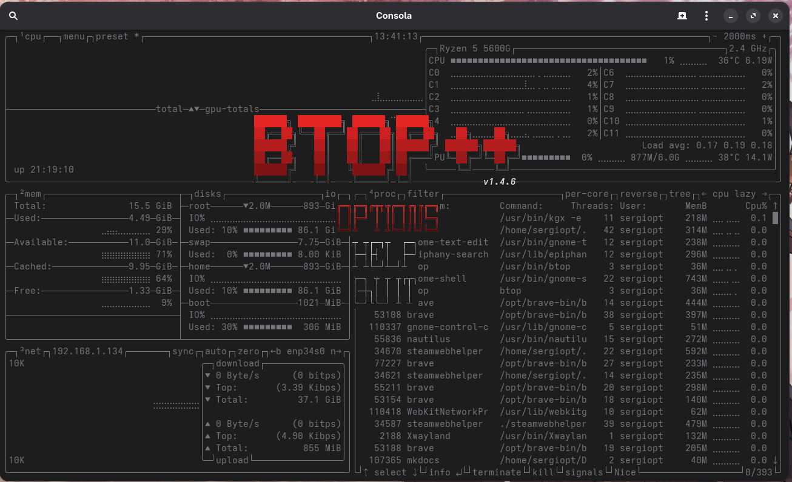
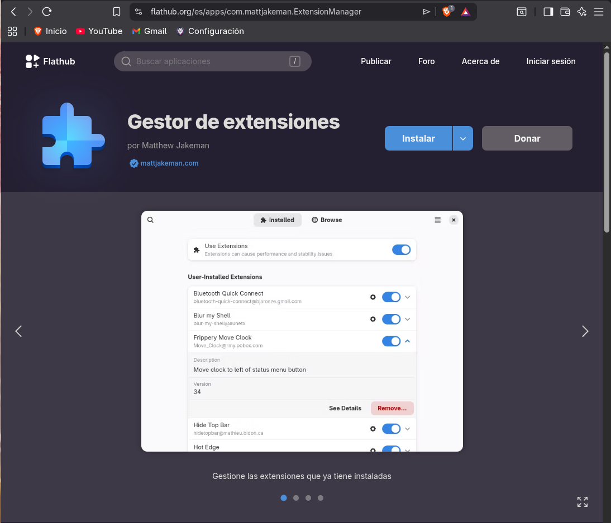
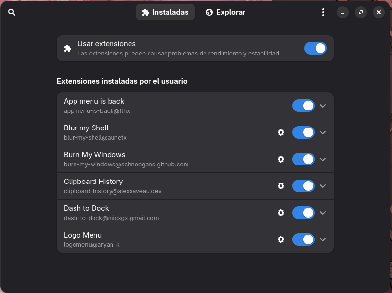

# Configuración del sistema

---

- [Monitorización del sistema](#monitorizacion-del-sistema-operativo)
- [Instalar AUR](#instalar-un-gestor-de-paquetes-para-aur)
- [Extensiones de GNOME](#extensiones-de-gnome)

Ahora vamos a hacer los primeros pasos de la configuración.

---

### Monitorización del sistema operativo

Quería incluir este punto para dar a conocer una aplicación de terminal que es una maravilla pero que no es muy conocida, esta aplicacion es **btop**.



Muestra una interfaz desde la terminal para visualizar los procesos y el rendimiento del equipo. Además tiene configuración que permite hacer muchos cambios (el más util poner un
tema a tu gusto) de manera muy intuitiva.

Para instalar en Arch Linux es tan sencillo como:

```bash
sudo pacman -S btop
```

---

### Instalar un gestor de paquetes para AUR

El **AUR (Arch User Repository)** es un repositorio mantenido por la comunidad donde se encuentran los programas que no están en los repositorios oficiales.

Hay varios gestores de AUR pero en mi caso utilizo yay. Para instalar:

```bash
sudo pacman -S --needed git base-devel
git clone https://aur.archlinux.org/yay.git
cd yay
```

Instalamos el paquete:

```bash
makepkg -si
```

Cuando termine la instalación podemos eliminar el repositorio clonado:

```bash
cd ..
rm -rf yay
```

---

### Extensiones de GNOME

Las extensiones de GNOME sirven para personalizar el sistema, voy a explicar como se instalan y voy a enseñar cuales uso.

La aplicación que recomiendo usar es:



Si no viene instalado el gestor de paquetes flatpak lo instalamos:

```bash
sudo pacman -S flatpak
```

Ahora instalamos el gestor de extensiones en caso de que tampoco venga instalado:

```bash
flatpak install flathub com.mattjakeman.ExtensionManager
```

Las extensiones que estoy usando son:



* **App menu is back**: muestra en la barra superior la aplicación en uso.
* **Blur My shell**: hace un movimiento de "desenfoque" en la barra superior, dock y fondo del menú de aplicaciones.
* **Burn My Windows**: incluye varias animaciones al abrir y cerras las aplicaciones, yo uso "**Aparición**".
* **Clipboard history**: historial para el portapapeles que por defecto se abre con **SUPER + SHIFT + V**.
* **Dash to dock**: el clásico dock que incorpora GNOME 3, pero personalizable.
* **Logo menu**: muestra el logo de la distribución con varias opciones en la barra superior.

Estas son las extensiones que uso en mi sistema principal, es un entorno de escritorio GNOME bastante minimalista pero con algunas mejoras que GNOME no tiene por defecto.
