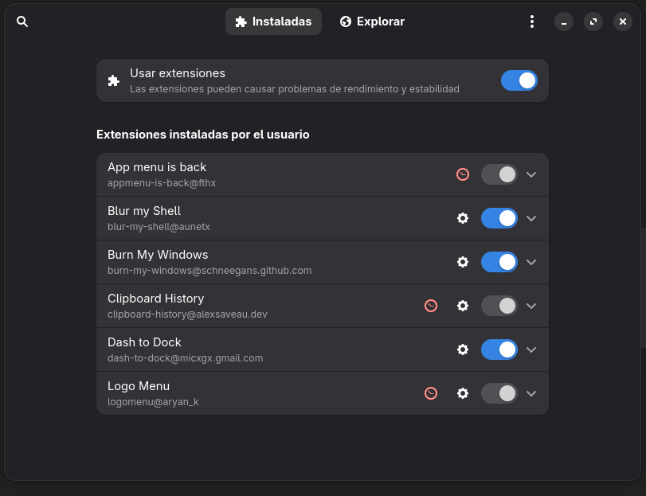

# Posibles errores

---

- [Desactivación automática de extensiones GNOME](#extensiones-de-gnome-se-desactivan-automaticamente)

---

## Extensiones de GNOME se desactivan automáticamente

Esto me paso al actualizar con `yay -Syu --noconfirm`, porque se me actualizó la version de GNOME a la 50.0, por lo que algunas extensiones se habían
desactivado "porque habían dejado de ser compatibles".



Mi solución fue forzar el funcionamiento de las extensiones, hay que entender que está opcion puede ser menos segura pero permite que sigas usando las extensiones.

```bash
gsettings set org.gnome.shell disable-extension-version-validation true
```

Este comando como se puede entender le dice a la configuración de GNOME que no haga validación sobre la versión de la extensiones.
