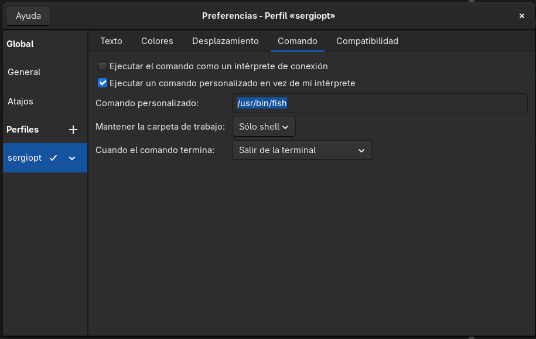
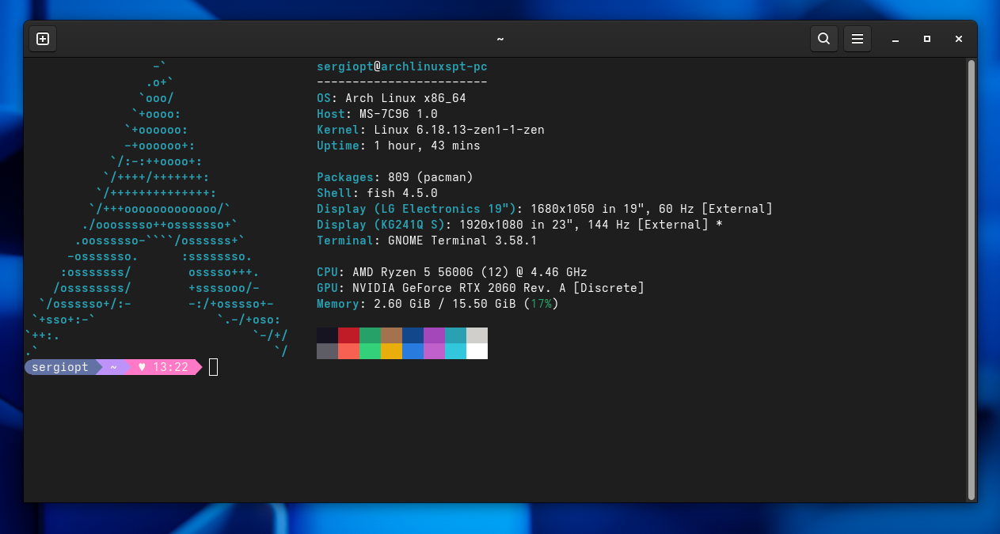

# Configuración de terminal

---

- [Instalar Fish](#instalar-fish)
- [Alias en Fish](#alias-en-fish)
- [Fastfetch](#fastfetch)
- [Oh-My-Posh](#instalar-y-configurar-oh-my-posh)

---

### Instalar Fish

Instalamos la shell:

```bash
sudo pacman -S fish
```

Ahora para que al abrir la terminal se lance Fish en vez de Bash yo cree un nuevo perfil en la aplicación de gnome-terminal:



Al activar ejecutar un comando personalizado le digo que al iniciar use la shell fish, hay mas maneras de hacerlo pero está es la que más me gusta.

Para quitar el mensaje de bienvenida podemos hacer `set -U fish_greeting`.

---

### Alias en Fish

Para añadir alias en esta shell se hace de manera muy sencilla. Lo vemos con este ejemplo de alias que suelo usar:

```fish
alias cl='clear && fastfetch -c paleofetch.jsonc'
funcsave cl
```

---

### Fastfetch
Vamos a instalar **Fastfetch**, un paquete que en mi opinión es una gran mejora respecto al clásico **Neofetch**.

```bash
sudo pacman -S fastfetch
```

Para aplicarlo en cada inicio en fish podemos configurar el archivo correspondiente, es parecido al .bashrc en bash o .zshrc en zsh:

```bash
cd ~
nano .config/fish/config.fish
```

Debajo del comentario añadimos lo que queremos que se ejecute en cada nueva sesión de la shell:

```fish
if status is-interactive
  # Commands to run in interactive sessions can go here
  fastfetch -c paleofetch.jsonc
end
```

---

### Instalar y configurar Oh-My-Posh

Ahora vamos con la personalización del prompt, aunque Fish también tiene un framework no lo veo tan relevante como en bash o zsh, ya que sin nada a mayores ya es una shell muy completa, por eso decidí usar oh-my-posh, que la función que va a tener es hacer la terminal más bonita.

Para la instalación:

```bash
yay -S oh-my-posh-bin
```

Ahora instalaremos las mismas fuentes que se muestrán en la [documentación](https://ohmyposh.dev/docs/installation/fonts):

```bash
oh-my-posh font install meslo
```

El fichero de configuracion de fish `~/.config/fish/config.fish` debe ser algo como esto:

```fish
if status is-interactive
  # Commands to run in interactive sessions can go here
  oh-my-posh init fish | source
  fastfetch -c paleofetch.jsonc
end
```

Hemos añadido `oh-my-posh init fish | source` para usar oh-my-posh en cada instancia de la shell.

---

Si queremos cambiar el tema debemos modificar está ultima linea que hemos añadido con un tema que corresponda en `~/.cache/oh-my-posh/themes` (se deberían haber instalado junto al paquete).

Yo voy a usar el tema de Dracula por lo cual voy a cambiar `oh-my-posh init fish | source` por `oh-my-posh init fish --config ~/.cache/oh-my-posh/themes/dracula.omp.json | source`

El resultado es:


